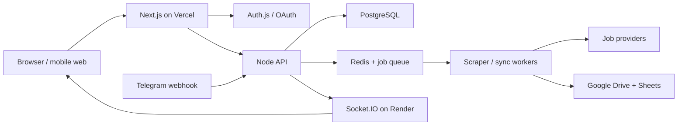

# Fresh Listings — Production System Design

Status: production baseline, 2026-08-09. The application runs on stock Next.js + Node, Vercel, Neon PostgreSQL, and the separately hosted realtime service.

## 1. Product goals

- Let users sign in, search global job sources, and preserve every job detail.
- Store the canonical history in PostgreSQL and synchronize a Google Sheet inside Drive.
- Accept Telegram prompts, stream progress in the dashboard, and send daily metrics.
- Scale by queueing provider work instead of holding a browser request open.

## 2. Target architecture

- Vercel hosts the stock Next.js App Router frontend, CDN assets, and short API handlers.
- Render hosts the Node.js API/worker and Socket.IO service with a public WebSocket endpoint.
- Managed PostgreSQL is the source of truth; Redis provides queue state and Socket.IO fan-out.
- Google Drive/Sheets, Telegram, job providers, email, and AI remain external integrations.

## 3. Service boundaries

- `web`: Next.js pages, protected UI, analytics queries, and signed realtime-token issuance.
- `api`: authenticated commands, provider adapters, Google integration, Telegram webhook, and outbox writes.
- `worker`: scrape, deduplicate, persist, Drive sync, digest, and retry jobs from Redis.
- `realtime`: Socket.IO connections, user rooms, Redis adapter, heartbeats, and graceful shutdown.

## 4. Durable data model

- `users` and `user_settings` own identity, defaults, digest preferences, and account configuration.
- `job_postings` uses `(owner_user_id, external_id)` for idempotent upserts and preserves the canonical source, reported portal, provider, and application links.
- `scrape_runs` records queued/running/succeeded/failed states, provider timing, errors, and idempotency keys.
- `user_integrations`, `telegram_links`, `outbox_events`, and `daily_metrics` isolate credentials, chats, delivery, and reporting.

## 5. Authentication and authorization

- Use Auth.js with Google/OIDC login for the public product; never trust a browser-supplied user id.
- Store only provider account identifiers and encrypted refresh tokens; keep secrets server-side.
- Authorize every query by `owner_user_id`; use PostgreSQL row-level security as a second boundary.
- Issue short-lived Socket.IO tokens containing only `sub`, email, expiry, and an HMAC signature.

## 6. Search and scraper flow

- The browser submits a validated search command and receives a job id quickly; it does not wait for providers.
- A queue worker calls provider adapters with timeouts, retry budgets, and per-provider rate limits.
- Normalization converts every provider response to one `job_postings` contract before persistence.
- Deduplication and outbox creation happen in one database transaction; repeated provider results are safe.

### 6.1 Source access policy

- `public_api` sources such as Greenhouse may run automatically without an end-user portal login.
- `approved_api` sources such as LinkedIn, Indeed, and Glassdoor remain disabled until written provider approval and credentials exist.
- `manual` sources open native search links and accept user-entered URLs/CSV; no portal password, cookie, MFA code, or CAPTCHA is stored.
- Source adapters must declare auth mode, quota, attribution, retention, and failure behavior before being enabled in production.

## 7. Realtime design

- Socket.IO authenticates during handshake and joins `user:{id}` rooms; clients reconnect with exponential backoff.
- Redis pub/sub is required when more than one realtime instance is running; the adapter is included in the migration baseline.
- Events are small and semantic: `scrape:started`, `scrape:progress`, `job:saved`, and `digest:ready`.
- Persist important state in PostgreSQL/outbox; Socket.IO is a notification path, not the source of truth.

## 8. Google Drive and Sheets

- Google account selection occurs through OAuth `select_account`; the typed email is never treated as authorization.
- The first sync creates a `Fresh Listings` Drive folder and a `Fresh Listings Job Tracker` Sheet inside it.
- Rows contain title, company, portal, provider, source, location, posting age, links, remote status, salary, fit fields, and capture time.
- Sync is idempotent through `synced_at` and provider/job uniqueness; failed syncs remain retryable.

## 9. Telegram automation

- Telegram sends a signed webhook update to the API; the bot chat is linked using a short-lived dashboard token.
- Prompts are parsed into keywords, location, time window, and source filters before a queue job is created.
- The webhook acknowledges quickly; the result message is sent after the worker persists jobs.
- Daily metrics are generated from `daily_metrics`, not from in-memory counters.

## 10. Email and digest delivery

- Email is optional and uses a provider such as Resend behind a server-side API key.
- The account email remains the default; any alternate destination must be explicitly confirmed in settings.
- Digest jobs read persisted job rows and include links back to the Sheet and dashboard.
- Delivery attempts, provider ids, and failures should be added to the outbox audit before enabling automation.

## 11. Initial latency budgets

- These are engineering targets, not guarantees; validate p50/p95/p99 from representative regions with synthetic probes.
- Cached static dashboard: p95 edge TTFB `<300 ms`; interactive first load `<2 s` on a broadband connection.
- Auth/session and ordinary API reads: p95 `<500 ms`; search enqueue acknowledgement: p95 `<250 ms`.
- Provider completion: p95 `<15 s` for a normal search; Google sync and email are asynchronous with p95 completion `<5 s` after enqueue.
- Realtime event delivery: p95 `<150 ms` in-region and `<400 ms` cross-region; Telegram webhook acknowledgement `<500 ms`.

## 12. Global deployment and latency strategy

- Place PostgreSQL, Redis, workers, and the primary API in one data region to avoid cross-region transaction latency.
- Use Vercel’s edge/CDN for static assets and route stateful API calls to the API region.
- Add read replicas or regional caches only after measured read pressure; do not split writes before consistency requirements are explicit.
- Add a second realtime region only with Redis/shared state and a tested reconnect strategy.

## 13. Reliability and failure handling

- Provider failures return a user-visible run status while preserving the previous saved history.
- Queue jobs use bounded exponential backoff, dead-letter retention, and idempotency keys.
- Google, Telegram, email, and AI calls have independent timeouts and circuit-breaker metrics.
- Render shutdown handling closes Socket.IO connections gracefully; clients reconnect and reload state from the API.

## 14. Security controls

- Validate and cap all prompt, URL, source, and provider inputs; never render job descriptions as unsanitized HTML.
- Keep `DATABASE_URL`, OAuth secrets, Telegram tokens, Redis URLs, and HMAC secrets out of client bundles and Git.
- Use HTTPS/WSS only, strict CORS, security headers, CSRF protection for cookie-authenticated mutations, and rate limits per user/IP.
- Rotate secrets, encrypt OAuth refresh tokens, redact tokens from logs, and retain audit events for security review.

## 15. Observability and SLOs

- Emit structured logs with request id, user id hash, job id, provider, queue id, and duration; never log tokens.
- Track API p50/p95/p99 latency, queue age, provider error rate, dedupe rate, sync failures, and Socket.IO disconnects.
- Initial availability target: 99.9% for dashboard/API and 99.5% for asynchronous provider completion.
- Alert on queue age, database connection saturation, Redis disconnects, webhook failures, and repeated OAuth errors.

## 16. Backup, retention, and recovery

- Enable automated PostgreSQL backups and test a point-in-time restore at least monthly.
- Keep job history indefinitely by default; apply configurable retention to raw provider payloads and outbox records.
- Redis is reconstructable; PostgreSQL, encrypted integration tokens, and migration files are not disposable.
- Maintain a documented rollback to the last Vercel/Render version; database backups remain the recovery source of truth.

## 17. Capacity and cost controls

- Start with one API, one worker, one realtime instance, managed PostgreSQL, and managed Redis.
- Bound concurrent provider requests and batch Google Sheet writes to prevent quota spikes.
- Scale workers on queue age and realtime instances on active connections, not only CPU.
- Add provider budgets, per-user quotas, and an administrative kill switch before public launch.

## 18. Required production secrets

- Web/API: `DATABASE_URL`, `AUTH_SECRET`, OAuth client credentials, `GOOGLE_TOKEN_ENCRYPTION_KEY`, `SEARCHAPI_API_KEY`, and optional email/AI keys.
- Telegram: `TELEGRAM_BOT_TOKEN`, `TELEGRAM_WEBHOOK_SECRET`, and a server-side bot username.
- Realtime: `REALTIME_SESSION_SECRET`, `REALTIME_EVENT_SECRET`, `REDIS_URL`, and exact `FRONTEND_ORIGIN`.
- Operations: `CRON_SECRET`, error-monitoring DSN, log endpoint credentials, and separate staging values.

## 19. Migration and rollout

- Phase 0: provision Vercel, Neon, Redis, Google OAuth, and the realtime host.
- Phase 1: apply the PostgreSQL schema and configure production/preview environment variables.
- Phase 2: deploy Next.js and the realtime service, then run the authenticated, scrape, sync, Telegram, and cron smoke tests.
- Phase 3: monitor latency and errors, promote the deployment, and use Vercel rollback plus Neon restore for incidents.

## 20. Definition of production-ready

- A new user can sign in, run a search, see progress, and find the same jobs after a refresh or reconnect.
- Google Drive/Sheets sync, Telegram prompts, daily metrics, retries, and audit history work without manual database edits.
- Dashboards show latency, errors, queue age, provider health, and integration failures with actionable alerts.
- Backups, secret rotation, incident response, rollback, and data deletion have been tested and documented.
